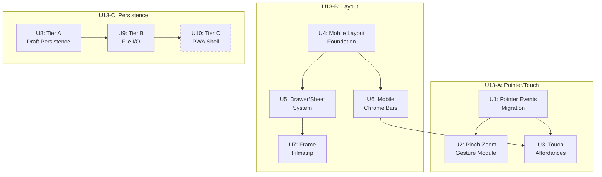

# feat: UQ-013 small-screen and persistence follow-through

## Summary

Three coupled workstreams on the root workbench editor: migrate canvas interaction to Pointer Events with one-pointer/two-pointer semantics (U13-A), restructure the layout for narrow screens with drawer-based auxiliary panels and compact chrome bars (U13-B), and implement three-tier browser persistence from always-on drafts through explicit file I/O to optional PWA shell (U13-C). U13-A and U13-B are interleaved since touch semantics and mobile layout are mutually dependent; U13-C follows only after the interaction and layout contracts are stable. Tier C PWA is the lowest-priority deliverable and should not land until Tiers A and B are solid.

---

## Problem Frame

The workbench root editor (`web/workbench.js`, `web/whole-sheet-init.js`) currently has three gaps that block mobile/tablet usability:

1. **Mixed input model.** `whole-sheet-init.js` and `rexpaint-editor/canvas.js` already use Pointer Events, but `workbench.js` surfaces (source canvas, grid panel, cell inspector) still bind `mousedown`/`mousemove`/`mouseup` exclusively. No two-pointer gesture detection exists anywhere. No `touch-action` CSS is declared -- only one programmatic `touchAction = 'none'` in `rexpaint-editor/canvas.js`. Touch and pen input on these surfaces is dead.

2. **No mobile layout.** The editor uses a 200px rigid sidebar (`.ws-layout`) with no responsive breakpoint. The only responsive CSS is a `.two-col` collapse at 1100px and an overlay modal adjustment at 600px. On a 375px phone screen the sidebar consumes over half the viewport with no way to dismiss it.

3. **No browser-local persistence.** All session state goes through Flask backend round-trips (`POST /api/workbench/save-session`). There is no auto-draft, no undo durability across page reloads, no file picker integration, and no offline capability. `localStorage` is used only for two unrelated preference keys.

The canonical spec (sections 1.8.7, 1.9.1-1.9.3) defines precise contracts for all three areas. This plan executes UQ-013 as an explicit reprioritization of that parked queue row.

---

## Requirements

- R1. All editor interaction uses Pointer Events; no separate mouse-only path remains authoritative (spec 1.9.1.2)
- R2. One pointer = tool input; two pointers = pan/zoom only, must never paint (spec 1.9.1.3, 1.8.7.2)
- R3. Canvas root owns `touch-action`; prevents browser gesture capture during tool input (spec 1.9.1.4, 1.8.7.3)
- R4. Every hover-only affordance has a touch equivalent: tap-hold inspect, selection handles, or visible status strip (spec 1.9.1.5)
- R5. Touch context actions use explicit selection toolbar; long-press is accelerator only (spec 1.9.1.6)
- R6. Narrow screens: canvas primary, panels become drawers/sheets, one dense panel at a time (spec 1.9.3.1-3)
- R7. Default mobile chrome: top bar (file/save/export + mode toggle), center canvas, bottom bar (tool switch + current layer + frame/location status), drawers for everything else (spec 1.9.3.4)
- R8. Frame navigation becomes compact filmstrip on mobile, not a second full grid (spec 1.9.3.5)
- R9. Three-tier persistence: always-on drafts via IndexedDB (A), explicit file I/O with picker/fallback (B), optional PWA shell (C) (spec 1.9.2.1-2)
- R10. Tier B prefers File System Access API with fallback; mobile always offers explicit export/share path (spec 1.9.2.3, 1.9.2.5)
- R11. Editor must not require installation; PWA is optional acceleration only, gated on `beforeinstallprompt` (spec 1.9.2.4)
- R12. Do not reopen the Section 1 owner graph: `whole-sheet-init.js` remains root owner, `workbench.js` remains subordinate (UQ-013 constraint)

---

## Scope Boundaries

- No Section 2 pipeline, source-manifest, or backend-authoring work
- No new tool creation (pointer migration covers existing tools only)
- No offline data sync or cloud persistence
- No wearable/mounted/item authoring surfaces
- No redesign of source panel or browse panel content -- only repositioning into drawers
- No conversion of existing continuous zoom slider to discrete steps (pinch-zoom snaps to discrete levels per spec 1.8.7.6; slider conversion is separate)
- No `Alt+wheel` layer cycling replacement for touch (deferred gesture design)
- Backend changes are default-excluded; justified only if browser persistence cannot land without a tiny supporting route or payload change

### Deferred to Follow-Up Work

- Discrete zoom-level slider conversion (current continuous slider stays; pinch-zoom uses discrete snap targets): separate U13-A follow-up
- Touch gesture for active-layer cycling (replaces `Alt+wheel` on touch): follow-up after U13-A lands
- Source panel and browse panel content redesign: separate Section 1 work beyond U13-B's drawer repositioning
- Touch-based frame reorder in filmstrip (native HTML drag-and-drop does not fire from touch): separate pointer-event drag implementation
- Swipe-to-dismiss gesture on drawers (requires JS pointer tracking beyond the CSS-only class-toggle approach): follow-up after drawer system proves out with tap-on-backdrop dismiss

---

## Context & Research

### Relevant Code and Patterns

| Surface | File | Current Event Model | Pointer Events? |
|---------|------|-------------------|-----------------|
| Whole-sheet canvas (REXPaint) | `web/rexpaint-editor/canvas.js` | Pointer Events + mouse fallback | Yes -- feature-detects `PointerEvent`, sets `touchAction: 'none'` |
| Whole-sheet overlay logic | `web/whole-sheet-init.js` | Pointer Events | Yes -- `pointerup`, `pointermove`, `pointerdown`; tracks `pointerId` for space-pan |
| Source canvas | `web/workbench.js` (~7961-7964) | `mousedown`/`mousemove`/`mouseup` | No |
| Grid panel (frame nav) | `web/workbench.js` (~6884-6967) | `mousedown`/`mousemove`/`mouseup` + HTML drag | No |
| Inspector canvas | `web/workbench.js` (~8193-8265) | `mousedown`/`mousemove`/`mouseup`/`mouseleave` | No |

- `canvasCoord(evt, canvas)` at `workbench.js:4624` uses `evt.clientX`/`evt.clientY` -- works with both `MouseEvent` and `PointerEvent`, so coordinate conversion needs no changes
- Space+drag panning in `whole-sheet-init.js` already tracks `e.pointerId` -- foundation for multi-pointer state
- Grid panel already has compact/micro CSS class variants (`frame-grid-compact`, `frame-grid-micro`) with CSS custom properties (`--wb-grid-cell-size`) -- foundation for filmstrip mode
- CSS uses `100dvh` dynamic viewport height and `-webkit-overflow-scrolling: touch` on overlay cards -- existing mobile-aware patterns to extend
- `.ws-layout` is flexbox: 200px rigid sidebar + `flex: 1` canvas area -- no mobile breakpoint
- Grid cell reorder uses native HTML `dragstart`/`dragover`/`drop` -- can stay as-is (drag events are distinct from pointer events)
- Input policy gate: `web/whole-sheet-input-policy.mjs` (331 bytes) -- may need touch gesture policy additions

### Institutional Learnings

- **P0 race condition**: `window.__workbenchTemplateGating` destructure in `workbench.js:7343` crashes the entire IIFE if the gating script fails to load. A service worker or aggressive cache serving `workbench.html` from cache while `workbench-template-gating.js` gets a 404 could trigger this. Must address before Tier C PWA work.
- **Owner graph**: `whole-sheet-init.js` is THE owner of root document state (geometry, image data, editor state, active layer, mode, tool, history). `workbench.js` may request commands and observe snapshots but must not directly mutate owned state (spec 1.8.1). Pointer migration and layout changes must stay within this boundary.
- **Deletion-first refactor rule** (spec 1.7): Do not add a new owner while leaving the old owner alive. When migrating pointer events, remove old mouse handlers before or atomically with adding pointer handlers -- do not leave both authoritative.
- **No build system**: No bundler or transpiler. New modules must be ES modules loaded via `<script type="module">` or inlined.

---

## Key Technical Decisions

- **Feature-detect PointerEvent** rather than hard-require: follow `rexpaint-editor/canvas.js` pattern with `typeof PointerEvent !== 'undefined'` guard and mouse-event fallback. Modern browsers universally support Pointer Events, but the fallback is trivial and already patterned in the codebase.
- **New ES module for gesture state machine** (`web/touch-gestures.mjs`): two-pointer pinch/pan detection stays out of the 143K `whole-sheet-init.js` monolith. Module exposes a declarative API consumed by the editor, not an event system.
- **New ES module for browser persistence** (`web/persistence.mjs`): clean separation from the Flask session API. IndexedDB for Tier A (structured data -- cells, layers, undo history, editor session state). OPFS reserved for future large-binary needs only.
- **IndexedDB over OPFS for Tier A**: the draft persistence pattern is structured read/write of JSON-serializable session state, not streaming large binary blobs. IndexedDB is better suited and has broader browser support.
- **CSS-only drawers with class toggle**: `transform: translateY()` / `translateX()` transitions, toggled by adding/removing a class on a container element. No framework dependency needed. Follows the existing overlay pattern in `styles.css`.
- **Mobile breakpoint at 768px**: screens at or below 768px get the full mobile layout (canvas-primary, drawers, chrome bars). The existing 1100px `.two-col` breakpoint handles medium-range tablet landscape. The 600px overlay breakpoint stays for modal-specific adjustment.
- **Pointer capture for drag operations** (`setPointerCapture`): replaces the current pattern of window-level `mouseup` listeners on source canvas and grid panel. Pointer capture ensures `pointerup` fires on the capturing element even when the pointer leaves the canvas, eliminating the need for global cleanup listeners.
- **Pinch-zoom snaps to discrete levels**: during pinch gesture, zoom interpolates continuously; on gesture end, snap to nearest spec-mandated level (50%, 75%, 100%, 150%, 200%, 300%, 400%). The existing continuous slider stays untouched.
- **Draft and server session coexistence**: Tier A browser drafts are a parallel persistence path, not a replacement for the Flask session API. On page load, the editor checks for a newer browser draft and offers to restore it. Server sessions remain the canonical named-session model.

---

## Open Questions

### Addressed During Planning

- **Where does multi-pointer tracking live?** In a new `web/touch-gestures.mjs` module, not inside `whole-sheet-init.js`. The whole-sheet editor calls into the gesture module, which tracks pointer state and reports gesture events back.
- **What breakpoint triggers mobile layout?** 768px -- wide enough that tablet portrait gets drawers, narrow enough that 7-inch tablets in landscape keep the sidebar.
- **Which storage API for Tier A?** IndexedDB -- the data is structured session state (cells, layers, undo stack), not binary streams. OPFS would add complexity with no benefit for this access pattern.
- **Does the grid panel's native HTML drag need migration?** Not for this plan. Native HTML drag-and-drop does not fire from touch input on mobile browsers. Frame reorder is explicitly desktop-only for this release; the mobile filmstrip (U7) is selection/navigation only. Touch-based reorder is deferred to a follow-up.

### Deferred to Implementation

- **Exact IndexedDB schema** (database name, object stores, indexes): depends on what session-state fields need indexing for draft lookup and cleanup queries
- **Drawer animation duration and easing**: depends on testing against actual hardware and perceived responsiveness
- **Selection toolbar positioning strategy**: edge-case handling (toolbar near viewport edge, small selection, toolbar occlusion) will be refined during implementation
- **Touch-action toggle timing**: whether `touch-action` switches from `none` to `auto` on tool deselection or on explicit mode change -- depends on seeing real touch behavior

---

## High-Level Technical Design

> *This illustrates the intended approach and is directional guidance for review, not implementation specification. The implementing agent should treat it as context, not code to reproduce.*

U13-A and U13-B share two parallel roots (U1, U4) that converge at U3 (touch affordances depend on both pointer events and mobile chrome). U13-C is sequenced behind U13-A/B. U10 (Tier C PWA) is dashed to signal lowest priority.

**Phased delivery:**

| Phase | Units | Gate |
|-------|-------|------|
| 1 (parallel roots) | U1 + U4 | Pointer events fire on all workbench surfaces; canvas-primary layout renders on narrow screens |
| 2 (parallel branches) | U2 + U5 + U6 | Pinch-zoom works; drawers slide; chrome bars visible |
| 3 (convergence) | U3 + U7 | Touch affordances landed; filmstrip navigable |
| 4 (persistence, sequential) | U8 then U9 then U10 | Drafts persist; file I/O works; PWA optional |

---

## Implementation Units

### U13-A: Pointer/Touch Contract

- U1. **Pointer Events migration for workbench.js surfaces**

**Goal:** Migrate source canvas, grid panel, and cell inspector canvas from mouse events to Pointer Events, following the pattern already established in `rexpaint-editor/canvas.js`. Add `touch-action` ownership to all interactive canvases. Remove mouse-only handlers atomically with adding pointer handlers per the deletion-first rule.

**Requirements:** R1, R3, R12

**Dependencies:** None

**Files:**
- Modify: `web/workbench.js`
- Modify: `web/styles.css`
- Test: `tests/pointer-events.spec.js`

**Approach:**
- Feature-detect `PointerEvent` and bind `pointerdown`/`pointermove`/`pointerup`/`pointercancel` on source canvas, grid panel, and inspector canvas; fallback to mouse events if absent
- Replace window-level `mouseup` listeners with `setPointerCapture` on `pointerdown` -- captured element receives `pointerup` even when pointer leaves the element
- Declare `touch-action: none` on `#sourceCanvas`, `#cellInspectorCanvas`, and `#gridPanel` canvas elements -- in CSS for consistency
- The `canvasCoord()` helper already uses `clientX`/`clientY` and needs no changes
- Grid panel row reorder via native HTML drag events stays unchanged
- Context menu handlers (`contextmenu`) stay unchanged -- they are event-type agnostic
- **Null-guard for `__workbenchTemplateGating`**: while modifying `workbench.js`, add a null-guard for the `__workbenchTemplateGating` destructure at line ~7343. This P0 race condition (gating script fails to load → IIFE crashes) is independent of U10's service worker but is most efficiently addressed here since U1 already modifies `workbench.js`. Landing it early ensures the editor doesn't crash under cache staleness regardless of whether U10 ever ships.

**Patterns to follow:**
- `web/rexpaint-editor/canvas.js:208-229` -- PointerEvent feature detection, handler binding, `touchAction = 'none'`
- `web/whole-sheet-init.js:836-861` -- pointer event binding on canvas with `pointerId` tracking

**Test scenarios:**
- Happy path: pointerdown/pointermove/pointerup fire correctly on source canvas during drawing operations
- Happy path: grid panel drag (mousedown+move pattern) works via pointer events; cell selection and resize functional
- Happy path: inspector canvas click and drag inspection works via pointer events
- Edge case: pointer leaves canvas during drag on source canvas -- `pointerup` still fires via pointer capture, no stale drag state
- Edge case: rapid pointer down/up sequences on inspector canvas do not leave orphaned event state
- Edge case: `pointercancel` (e.g., browser takes over gesture) cleanly resets drag state
- Error path: browser without `PointerEvent` (legacy or unusual environment) falls back to mouse events and all surfaces remain functional
- Integration: pointer events on `workbench.js` surfaces coexist with existing pointer events on `whole-sheet-init.js` -- no double-handling or event interference when both are mounted

**Verification:**
- All three workbench canvas surfaces respond to touch and pen input, not just mouse
- No `mousedown`/`mousemove`/`mouseup` event bindings remain as authoritative paths on these surfaces (fallback behind feature detection is acceptable)
- `touch-action: none` declared on all interactive canvas elements

---

- U2. **Two-pointer pinch-zoom gesture module**

**Goal:** Detect two-pointer pinch and pan gestures on the whole-sheet canvas and translate them into zoom and scroll operations. Snap to discrete zoom levels at gesture end. Keep gesture state machine in a new ES module to avoid growing `whole-sheet-init.js`.

**Requirements:** R2, R3

**Dependencies:** U1

**Files:**
- Create: `web/touch-gestures.mjs`
- Modify: `web/whole-sheet-init.js`
- Modify: `web/rexpaint-editor/canvas.js`
- Modify: `web/workbench.html`
- Test: `tests/pinch-zoom.spec.js`

**Approach:**
- Note: the authoritative `pointerdown` handler for the whole-sheet canvas lives in `rexpaint-editor/canvas.js` (drawing), not `whole-sheet-init.js` (which only binds `pointerup`/`pointermove`/`pointerleave` and a capture-phase `pointerdown` for paste mode). The gesture module must coordinate with `canvas.js`'s `pointerdown` to suppress drawing during two-pointer gestures.
- New module exports a gesture tracker that the editor canvas hooks into via pointer events
- Gesture tracker caches active pointers (via `pointerId`); when count reaches two, enters pinch/pan mode
- During pinch/pan mode: compute pinch distance delta for zoom, midpoint delta for pan
- On gesture end (one pointer lifts): snap zoom to nearest discrete level (50%, 75%, 100%, 150%, 200%, 300%, 400%) and resume single-pointer tool input
- Integrate with existing `_applyCanvasZoom()` in `whole-sheet-init.js` for zoom and `scrollWrap.scrollLeft/scrollTop` for pan
- While two pointers are active, suppress all tool input (no painting, no selection) per R2
- `touch-action: none` on the canvas root must be active during gesture to prevent browser default pinch-zoom

**Patterns to follow:**
- MDN Pointer Events pinch-zoom guidance (referenced in spec 1.9.1 sources)
- `whole-sheet-init.js` space-pan state machine (`spacePan` state, `pointerId` tracking) -- similar two-state model

**Test scenarios:**
- Happy path: two-pointer pinch on whole-sheet canvas zooms in/out proportionally to pinch distance
- Happy path: two-pointer pan on whole-sheet canvas scrolls the viewport
- Happy path: on gesture end, zoom snaps to nearest discrete level
- Edge case: one pointer lifts during active pinch -- remaining pointer becomes tool input, no stale gesture state
- Edge case: three or more simultaneous pointers -- only first two tracked; additional pointers ignored
- Edge case: pinch gesture crosses a zoom-level boundary -- snaps to the crossed level, not back to origin
- Edge case: very small pinch delta (jitter) -- does not trigger zoom change; requires minimum threshold
- Error path: gesture module not loaded (script error) -- pointer events still work for single-pointer tool input, pinch-zoom unavailable
- Integration: pinch-zoom state syncs with the existing zoom slider -- slider value reflects pinch-driven zoom changes

**Verification:**
- Two-finger pinch on touch device zooms the whole-sheet canvas
- Two-finger drag on touch device pans the whole-sheet canvas
- No paint strokes occur while two pointers are active
- Zoom level snaps to a discrete spec-mandated value when gesture ends

---

- U3. **Touch equivalents for hover affordances**

**Goal:** Provide touch-accessible alternatives for every hover-only affordance in the editor: a floating selection toolbar for context actions, tap-hold for inspection, and a visible status strip in the bottom chrome bar (from U6).

**Requirements:** R4, R5

**Dependencies:** U1, U6

**Files:**
- Modify: `web/whole-sheet-init.js`
- Modify: `web/workbench.js`
- Modify: `web/styles.css`
- Modify: `web/workbench.html`
- Test: `tests/touch-affordances.spec.js`

**Approach:**
- **Selection toolbar**: on touch devices, when a cell or region is selected, show a floating toolbar near the selection with context actions (copy, paste, delete, properties). Toolbar is a DOM element positioned relative to the selection's viewport coordinates, not a native context menu. Long-press opens the same toolbar as an accelerator.
- **Tap-hold inspect**: on touch devices, a press-and-hold (~500ms threshold) on a cell without dragging triggers cell inspection (same data the hover preview shows on desktop). Replaces hover-preview affordance.
- **Status strip**: the bottom chrome bar (U6) carries persistent status -- active layer name, cursor position, frame index -- that was previously only visible via hover tooltip or sidebar. No new widget needed if U6's bottom bar carries this information.
- On non-touch devices (detected via `pointerType === 'mouse'`), hover affordances remain unchanged.

**Patterns to follow:**
- Existing `contextmenu` handler pattern in `workbench.js` for the actions the toolbar should expose
- Bottom bar from U6 for status strip placement

**Test scenarios:**
- Happy path: tap-hold on a cell for 500ms shows context toolbar near the selection on touch device
- Happy path: toolbar actions (copy, paste, delete, inspect) execute correctly from the toolbar
- Happy path: single-tap on a cell is treated as tool input, not as a context trigger
- Edge case: tap-hold near viewport edge repositions toolbar to stay fully visible
- Edge case: tap-hold threshold -- a 400ms press followed by drag is tool input (move/draw), not context
- Edge case: toolbar dismisses on tap outside, on tool change, or on new selection
- Error path: on non-touch devices (`pointerType === 'mouse'`), hover affordances remain unchanged, toolbar does not appear
- Integration: toolbar state and selection state are synchronized -- clearing the selection dismisses the toolbar

**Verification:**
- Every affordance that was previously hover-only has a discoverable touch path
- Long-press and selection toolbar are functional on a real touch device
- Desktop hover behavior is unchanged

---

### U13-B: Small-Screen Layout Contract

- U4. **Canvas-primary mobile layout foundation**

**Goal:** Introduce a mobile breakpoint that makes the whole-sheet canvas the primary surface on narrow screens, hiding the rigid sidebar and letting the canvas take full width. This is the structural foundation for drawers (U5) and chrome bars (U6).

**Requirements:** R6, R12

**Dependencies:** None

**Files:**
- Modify: `web/styles.css`
- Modify: `web/workbench.html`
- Test: `tests/mobile-layout.spec.js`

**Approach:**
- Add `@media (max-width: 768px)` breakpoint to `styles.css`
- At this breakpoint: hide `.ws-sidebar`, make `.ws-canvas-area` full-width, adjust `.ws-scroll-wrap` max-height to use available viewport height (dynamic viewport units)
- Ensure the `#wholeSheetPanel` can take the full viewport on mobile when the editor is open
- Override `.ws-layout` `min-height` and `max-height` at the 768px breakpoint (e.g., `min-height: 0; max-height: none`) to let the canvas area fill available viewport height -- the desktop constraints (400px min, 700px max) would clip mobile viewports
- Adjust `.wrap` max-width constraint so it does not clip narrow screens
- Verify `<meta name="viewport" content="width=device-width, initial-scale=1, viewport-fit=cover">` is present in `workbench.html` (`viewport-fit=cover` enables `env(safe-area-inset-*)` on notched devices)
- Do not change the desktop layout (above 768px) in any way

**Patterns to follow:**
- Existing `.two-col` responsive pattern at 1100px breakpoint -- same approach, lower threshold
- Existing `.overlay` mobile adjustments at 600px -- `100dvh`, `-webkit-overflow-scrolling: touch`

**Test scenarios:**
- Happy path: at 768px or below, canvas takes full viewport width, sidebar is not visible
- Happy path: at 769px or above, sidebar + canvas layout is unchanged from current
- Edge case: orientation change (portrait to landscape) triggers correct layout without reload
- Edge case: canvas resize handler fires correctly after layout change -- editor redraws at new dimensions
- Edge case: `max-height` on scroll containers uses dynamic viewport units to account for mobile browser chrome
- Integration: whole-sheet editor mount/unmount works correctly in both mobile and desktop layouts -- no orphaned DOM or event listeners

**Verification:**
- On a 375px-wide viewport, the canvas is visible and usable with no sidebar
- On a 1024px viewport, the sidebar + canvas layout is unchanged
- No layout shift or flash when crossing the 768px threshold

---

- U5. **Drawer/sheet system for auxiliary panels**

**Goal:** Build a CSS-driven drawer system that houses the panels previously shown in the sidebar: layers, frames, source helpers, and browse/files. Only one drawer may be open at a time on mobile. Drawers slide over the canvas and can be dismissed by tapping a backdrop.

**Requirements:** R6, R7, R8

**Dependencies:** U4

**Files:**
- Modify: `web/styles.css`
- Modify: `web/workbench.html`
- Modify: `web/workbench.js`
- Modify: `web/whole-sheet-init.js`
- Test: `tests/drawers.spec.js`

**Approach:**
- Modify `_buildSidebar()` in `whole-sheet-init.js` to wrap each logical panel group (layers, frames, tools, browse/files) in a drawer container element at DOM build time. On desktop the drawer wrapper uses `display: contents` so it is structurally transparent; on mobile it becomes the slidable bottom-sheet container. This avoids runtime DOM reparenting while enabling independent drawer visibility per panel group.
- Bottom-sheet style on mobile (slide up from bottom edge) -- matches native mobile conventions and keeps the canvas visible above. Each drawer container uses `transform: translateY(100%)` off-screen, transitioning to `translateY(0)` when its `open` class is added.
- Backdrop overlay behind the open drawer; tap-on-backdrop dismisses
- One-at-a-time constraint: opening a drawer adds an `open` class on that drawer's container and removes it from all others; managed by a single toggle function in `workbench.js`
- On desktop (above 768px), drawer wrappers are `display: contents` and panels render in the sidebar as before -- no visual or structural change above the breakpoint

**Patterns to follow:**
- Existing `.overlay` pattern in `styles.css` -- anchored positioning, backdrop, `-webkit-overflow-scrolling: touch`
- CSS `transform` + `transition` for slide animation (no JS animation library)

**Test scenarios:**
- Happy path: tapping "Layers" button opens the layers drawer, panel content visible
- Happy path: tapping "Frames" while layers drawer is open closes layers, opens frames
- Happy path: tapping backdrop overlay dismisses the open drawer
- Edge case: drawer content scrolls independently when content overflows the drawer height
- Edge case: rapid toggle of same drawer (open-close-open) settles without animation glitches
- Edge case: drawer respects safe area insets on notched devices
- Integration: drawer panels contain the same controls as desktop sidebar -- toggling a layer in the drawer has the same effect as toggling it in the sidebar

**Verification:**
- On mobile, each auxiliary panel is accessible via its drawer and fully functional
- Only one drawer is open at a time
- Desktop layout is not affected by the drawer markup

---

- U6. **Mobile chrome bars**

**Goal:** Add persistent top and bottom bars on mobile that provide quick access to the most common actions (file operations, tool switching, status) without opening a drawer.

**Requirements:** R7

**Dependencies:** U4

**Files:**
- Modify: `web/workbench.html`
- Modify: `web/styles.css`
- Modify: `web/workbench.js`
- Test: `tests/mobile-chrome.spec.js`

**Approach:**
- **Top bar**: file/new/save/export actions + mode toggle (editor mode selector). Pinned to viewport top on mobile. Contains drawer toggle buttons (layers, frames, source, browse).
- **Bottom bar**: active tool indicator + tool switch buttons, current layer name, frame index, cursor position. Pinned to viewport bottom on mobile. Uses `padding-bottom: env(safe-area-inset-bottom, 0px)` to avoid collision with the system home indicator on notched devices.
- Both bars hidden above 768px (desktop layout has these in the sidebar and panel headers)
- Canvas area uses `padding-top` and `padding-bottom` (or equivalent) to avoid being occluded by the pinned bars
- Button actions delegate to the same handlers used by the desktop UI -- no duplicated logic
- The bottom bar serves double duty as the status strip for R4 (touch equivalent of hover-tooltip information)

**Patterns to follow:**
- Existing button handler pattern in `workbench.js` -- `$("buttonId").addEventListener("click", handler)`
- CSS pinned positioning + `z-index` layering above canvas, below drawers/overlays

**Test scenarios:**
- Happy path: top bar shows file, new, save, export buttons and mode toggle; all functional
- Happy path: bottom bar shows active tool, current layer name, frame index, and cursor position
- Happy path: tool switch from bottom bar changes the active tool in the editor
- Edge case: top and bottom bars remain visible when a drawer is open (drawer slides between them, not over them)
- Edge case: status in bottom bar updates in real time during editing -- layer name changes when layer switches, position updates on pointer move
- Edge case: bars do not overlap notch or system UI on devices with safe area insets
- Integration: top bar save/export buttons trigger the same action paths as the desktop panel equivalents

**Verification:**
- On mobile, common actions are reachable without opening any drawer
- Status information (layer, position, frame) is always visible in the bottom bar
- Bars are invisible on desktop

---

- U7. **Compact frame filmstrip**

**Goal:** Replace the full frame grid with a horizontal filmstrip on mobile -- a compact scrollable strip showing frame thumbnails that can be tapped to select.

**Requirements:** R8

**Dependencies:** U5

**Files:**
- Modify: `web/styles.css`
- Modify: `web/workbench.js`
- Modify: `web/workbench.html`
- Test: `tests/filmstrip.spec.js`

**Approach:**
- On mobile, the frame navigation surface uses the existing `frame-grid-micro` CSS variant but laid out as a horizontal `overflow-x: auto` strip instead of a wrapping grid
- Frame thumbnails scroll horizontally; tapping a frame selects it and updates the canvas
- Active frame is visually distinguished (border, background) and auto-scrolled into view when selection changes
- Filmstrip lives inside the frames drawer (U5) -- opening the frames drawer reveals the filmstrip
- On desktop, the full frame grid remains unchanged
- **Frame reorder is selection-only on mobile**: native HTML drag-and-drop (`dragstart`/`dragover`/`drop`) does not fire from touch input on mobile Safari or Chrome for Android. The filmstrip supports frame selection and navigation only; frame reorder remains a desktop-only operation until a pointer-event-based drag implementation is added in a follow-up

**Patterns to follow:**
- Existing `frame-grid-micro` CSS class and `--wb-grid-cell-size` custom property
- `overflow-x: auto` horizontal scroll pattern

**Test scenarios:**
- Happy path: filmstrip shows frame thumbnails in a horizontal strip inside the frames drawer
- Happy path: tapping a frame thumbnail selects that frame and updates the main canvas
- Happy path: horizontal scroll navigates through all frames
- Edge case: 50+ frames render without layout overflow or performance degradation
- Edge case: active frame is always visible -- auto-scrolls into view when selection changes programmatically
- Edge case: filmstrip thumbnail size adapts if `--wb-grid-cell-size` custom property is changed
- Integration: filmstrip selection state is synchronized with the full frame grid on desktop -- switching between mobile and desktop layout preserves the selected frame

**Verification:**
- On mobile, frame navigation is a compact horizontal strip, not a full grid
- Frames can be browsed and selected efficiently via the filmstrip
- Full frame grid on desktop is unaffected

---

### U13-C: Persistence Contract

- U8. **Tier A -- always-on draft persistence**

**Goal:** Implement auto-save of the active editor session to IndexedDB so that page reloads, crashes, and accidental tab closures do not lose work. Restore the most recent draft on page load.

**Requirements:** R9, R12

**Dependencies:** U1 (persistence hooks attach to `whole-sheet-init.js` lifecycle; pointer migration must stabilize the event surface first to avoid concurrent edits to the same file across workstreams)

**Files:**
- Create: `web/persistence.mjs`
- Modify: `web/whole-sheet-init.js`
- Modify: `web/workbench.js`
- Modify: `web/workbench.html`
- Test: `tests/persistence-tier-a.spec.js`

**Approach:**
- New `web/persistence.mjs` module encapsulates all IndexedDB operations: open database, save draft, load draft, list drafts, delete stale drafts
- Draft payload: active image cell data, layer state, bounded undo history (last N entries, not the full 50-entry stack -- full undo snapshots for large documents would exceed IndexedDB quota), editor session state (zoom level, pan position, grid visibility, active layer, active tool) per spec 1.8.7.7. Exact undo bound and size budget determined during implementation.
- Auto-save triggers: after each stroke end (via existing lifecycle hook in `whole-sheet-init.js`), on layer/frame changes. Debounced auto-save is the primary durability mechanism.
- **`beforeunload` is best-effort only**: IndexedDB writes are asynchronous and modern browsers abort pending transactions during page teardown. The `beforeunload` handler fires a non-blocking IDB write (fire-and-forget) and writes a lightweight `dirty` flag to `localStorage` as a recovery signal. On next load, if the `dirty` flag is set but the IDB draft is stale/missing, show a "last save may be incomplete" notification. Do not depend on `beforeunload` for durability -- the debounced stroke-end saves are the true safety net.
- On page load, check for a draft newer than the last server session load; if found, show a restore banner with two explicit actions: "Restore draft" and "Start fresh." If the user begins editing without choosing, new edits build on the current (server) session state, not the draft. The banner auto-dismisses after a timeout (e.g., 30 seconds) or on first user interaction with the canvas.
- Draft cleanup: remove drafts older than a configurable threshold (default: 7 days) on module initialization
- Persistence failures are silent -- a toast/banner notification at most, never a blocking error that interrupts editing
- The Flask server session API remains unchanged and coexists; Tier A is a parallel browser-local safety net

**Patterns to follow:**
- Existing session save payload structure in `workbench.js` (`saveSession` function) -- draft payload mirrors the same fields for consistency
- ES module pattern for `web/persistence.mjs` -- imported by `workbench.js` and `whole-sheet-init.js`

**Test scenarios:**
- Happy path: after drawing several strokes, reload the page -- draft restore banner appears, clicking restore recovers the image and undo stack
- Happy path: multiple drafts from different sessions coexist in IndexedDB
- Happy path: stale drafts (>7 days) are cleaned up on initialization
- Edge case: IndexedDB unavailable (private browsing in some browsers) -- editing continues without auto-save, no errors shown
- Edge case: very large session (200x200 cells, 10 layers, long undo history) saves within a reasonable time -- debounce prevents blocking the UI
- Edge case: `beforeunload` writes best-effort IDB save and `localStorage` dirty flag; on next load, dirty flag triggers "last save may be incomplete" notification if IDB draft is stale
- Error path: IndexedDB write failure (quota exceeded, disk full) -- logs warning, does not interrupt editing
- Error path: corrupted draft data in IndexedDB -- skips restore, shows brief error notification, does not crash
- Integration: draft restore and server session load coexist -- user can choose to restore a draft or load a named server session independently

**Verification:**
- Accidental page reload does not lose the current editing state
- Draft restore correctly reconstructs image data, layer state, and undo history
- Editing works normally when IndexedDB is unavailable

---

- U9. **Tier B -- explicit file I/O**

**Goal:** Add explicit open/save/export actions using the File System Access API where available, with fallback to file input and Blob download. Ensure mobile always has an export/share path.

**Requirements:** R10

**Dependencies:** U8

**Files:**
- Modify: `web/persistence.mjs`
- Modify: `web/workbench.js`
- Modify: `web/workbench.html`
- Test: `tests/persistence-tier-b.spec.js`

**Approach:**
- **Open**: detect `showOpenFilePicker` availability; if present, use it to open `.xp` files directly into the editor. If absent, fall back to `<input type="file" accept=".xp">` (which already exists for import-xp). The difference from current import: Tier B open obtains a file handle for subsequent save-back.
- **Save**: if a file handle is held from a prior open or save-as, write back to the same handle (`createWritable()`). If no handle, prompt via `showSaveFilePicker`. Fallback: generate a Blob and trigger a download link.
- **Export**: always available as a Blob download -- same outcome as current `export-xp` but routed through the browser-local path first, bypassing the Flask round-trip when possible. On mobile, prefer the Web Share API (`navigator.share({ files: [...] })`) when available.
- **Save-back-to-same-file**: only on desktop browsers with File System Access API. Once a handle is obtained, the "Save" action reuses it without showing a picker each time. Permission re-prompt handled gracefully.
- Clear the "unsaved" draft state in Tier A after a successful Tier B save
- The existing Flask-based import/export endpoints remain as the server-session path; Tier B is the browser-local file path

**Patterns to follow:**
- Existing XP import via file input in `workbench.js` -- the fallback path mirrors this, adding a save counterpart
- Existing Blob generation patterns for export

**Test scenarios:**
- Happy path: "Open" via File System Access API opens a file picker, loads the selected XP file into the editor
- Happy path: "Save" with an active file handle writes back to the same file without showing a picker
- Happy path: "Save As" always shows a file picker, obtains a new handle
- Happy path: fallback -- "Open" via file input and "Save" via Blob download work on browsers without File System Access API
- Edge case: file handle permission revoked between saves -- re-prompts for permission or falls back to save-as
- Edge case: mobile export via Web Share API when `navigator.share` supports files
- Edge case: mobile "Save" without File System Access API -- triggers download, shows a brief notification explaining that mobile cannot save back to the same file
- Error path: corrupted or non-XP file selected for open -- shows user-friendly error, does not crash
- Error path: user cancels the file picker -- no action, no error
- Integration: Tier B save clears the Tier A draft's "unsaved" flag -- after saving to a file, the draft restore banner does not appear for the same content

**Verification:**
- On a desktop browser with File System Access API: open, edit, save, reopen confirms round-trip fidelity
- On a mobile browser: open via file input and export via share or download are both functional
- Fallback paths work when File System Access API is absent

---

- U10. **Tier C -- optional PWA shell (lowest priority)**

**Goal:** Add a minimal PWA manifest and service worker so the editor can be installed as a standalone app and work offline. This is the lowest-priority deliverable -- do not land until U8 and U9 are solid.

**Requirements:** R11

**Dependencies:** U8, U9

**Files:**
- Create: `web/manifest.json`
- Create: `web/sw.js`
- Modify: `web/workbench.html`
- Modify: `web/workbench.js`
- Test: `tests/pwa.spec.js`

**Approach:**
- **Prerequisite**: the `__workbenchTemplateGating` null-guard must be in place (landed in U1) before introducing a service worker.
- **Manifest**: minimal `manifest.json` with app name, icons, display mode `standalone`, theme color, start URL
- **Service worker**: cache-first strategy for static assets (HTML, CSS, JS, icons). Network-first for API calls. Cache versioning for update propagation.
- **Install prompt**: listen for `beforeinstallprompt`, store the event, surface a non-intrusive install button or banner. Do not show the prompt on first visit -- gate on return-visit heuristic or explicit user action.
- **Offline**: with Tier A draft persistence (U8) and Tier B file I/O (U9) in place, the editor is functional offline for local editing. Service worker ensures assets are cached. Server-session operations fail gracefully offline (already handled by existing error paths in `workbench.js`).
- Editor must work identically without installation -- PWA is optional acceleration only

**Patterns to follow:**
- MDN PWA install prompt guidance (referenced in spec 1.9.2 sources)
- Cache-first / network-first strategy selection per resource type

**Test scenarios:**
- Happy path: `__workbenchTemplateGating` null-guard prevents crash when gating script fails to load
- Happy path: service worker registers and caches static assets on first visit
- Happy path: install prompt appears after `beforeinstallprompt` fires (not on first visit)
- Happy path: installed app works offline -- assets load from cache, editing uses Tier A drafts
- Edge case: service worker update does not break an existing in-progress editing session
- Edge case: `beforeinstallprompt` does not fire (e.g., already installed, or non-supporting browser) -- no install UI shown, no error
- Edge case: cache-only mode with stale assets -- service worker version check triggers update on next online visit
- Error path: service worker registration failure -- editor works normally with no offline capability
- Integration: offline editing uses Tier A draft persistence; on reconnect, the user can manually trigger server session save -- no automatic sync occurs

**Verification:**
- Editor is installable as a standalone app on supporting platforms
- Installed app works offline for local editing
- Editor works identically without installation
- The gating script null-guard is in place

---

## System-Wide Impact

- **Interaction graph:** Pointer event migration in `workbench.js` surfaces must not interfere with existing pointer events in `whole-sheet-init.js`. Both bind to separate DOM elements (workbench panels vs. whole-sheet canvas), so event propagation should not conflict. The pinch-zoom gesture module introduces a new two-pointer path into `whole-sheet-init.js`'s existing single-pointer flow -- the entry/exit between tool mode and gesture mode is the critical state transition.
- **Error propagation:** Persistence failures (IndexedDB, file I/O, service worker) must never block editing. All persistence errors surface as non-blocking notifications (toast/banner) and are logged. The editor must remain fully functional with zero persistence features available.
- **State lifecycle risks:** Browser drafts (Tier A) introduce a second source of session truth alongside Flask server sessions. Divergence is expected and handled: on page load, the user chooses between draft restore and server session load. Clearing draft state after Tier B save prevents stale-draft confusion. Stale-draft cleanup (>7 days) prevents unbounded IndexedDB growth.
- **API surface parity:** No backend API changes planned. The existing Flask session endpoints remain unchanged. Tier B file I/O adds a browser-local file path that parallels (does not replace) the server import/export endpoints.
- **Integration coverage:** Pointer migration needs real touch-device testing -- emulated touch in Playwright covers functional correctness but not gesture ergonomics. Pinch-zoom requires multi-touch simulation. Drawer animations and mobile chrome need real-device viewport testing.
- **Unchanged invariants:** `whole-sheet-init.js` remains the root owner of editor state. `workbench.js` remains subordinate -- it may request commands and observe snapshots but must not directly mutate layers, history, mode, tool state, or panel visibility. All Flask backend endpoints remain unchanged. The Section 2 pipeline and source-manifest surfaces are not touched.

---

## Risks & Dependencies

| Risk | Mitigation |
|------|------------|
| `workbench.js` is a 362K monolith -- pointer migration touches multiple handler clusters spread across thousands of lines | Scope migration to the three specific handler clusters identified in research (source canvas, grid panel, inspector); do not refactor surrounding code |
| Two-pointer gestures may conflict with browser default pinch-zoom despite `touch-action: none` | Test on real devices early; verify `touch-action: none` is applied before first `pointerdown` fires, not asynchronously |
| IndexedDB storage limits vary by browser and can be silently evicted | Draft persistence is best-effort; never block on it. Warn if quota check shows low remaining storage |
| File System Access API availability is Chrome/Edge-only; Safari and Firefox do not support it | Fallback path (file input + Blob download) is always available; feature-detect before offering picker UI |
| P0 gating-script race condition could crash the editor under cache staleness | Null-guard lands in U1 (earliest workbench.js touch), not deferred to lowest-priority U10 |
| Mobile layout restructure could break desktop layout if media queries leak | All mobile-specific CSS is inside `@media (max-width: 768px)` -- no desktop styles modified. Verify with above-breakpoint tests |
| Drawer wrappers modify `_buildSidebar()` DOM structure -- could break existing sidebar panel selectors or JS | Wrappers use `display: contents` on desktop (structurally transparent); only `@media (max-width: 768px)` activates drawer positioning. Verify existing panel JS selectors still match after wrapping |
| Native HTML drag-and-drop does not fire from touch input on mobile browsers | Frame reorder is explicitly desktop-only for this release; filmstrip is selection/navigation only. Pointer-event-based touch reorder deferred to follow-up |

---

## Sources & References

- Canonical spec: `docs/plans/2026-03-23-workbench-canonical-spec.md` -- sections 1.8.7 (line 1161), 1.9.1 (line 1193), 1.9.2 (line 1230), 1.9.3 (line 1272)
- UQ-013 queue row: canonical spec line 2984
- Existing pointer events pattern: `web/rexpaint-editor/canvas.js:208-229`
- Existing pointer events usage: `web/whole-sheet-init.js:836-861`
- Mouse-only surfaces: `web/workbench.js:7961-7964` (source), `6884-6967` (grid), `8193-8265` (inspector)
- P0 race condition: `web/workbench.js:7343` (`__workbenchTemplateGating` destructure)
- Input policy gate: `web/whole-sheet-input-policy.mjs`
- CSS layout: `web/styles.css` -- `.ws-layout`, `.two-col` breakpoint, `.overlay` mobile breakpoints
- MDN Pointer Events: https://developer.mozilla.org/en-US/docs/Web/API/Pointer_events
- MDN touch-action: https://developer.mozilla.org/en-US/docs/Web/CSS/touch-action
- MDN Pinch zoom gestures: https://developer.mozilla.org/en-US/docs/Web/API/Pointer_events/Pinch_zoom_gestures
- MDN File System API: https://developer.mozilla.org/en-US/docs/Web/API/File_System_API
- MDN OPFS: https://developer.mozilla.org/en-US/docs/Web/API/File_System_API/Origin_private_file_system
- MDN PWA install prompt: https://developer.mozilla.org/en-US/docs/Web/Progressive_web_apps/How_to/Trigger_install_prompt
